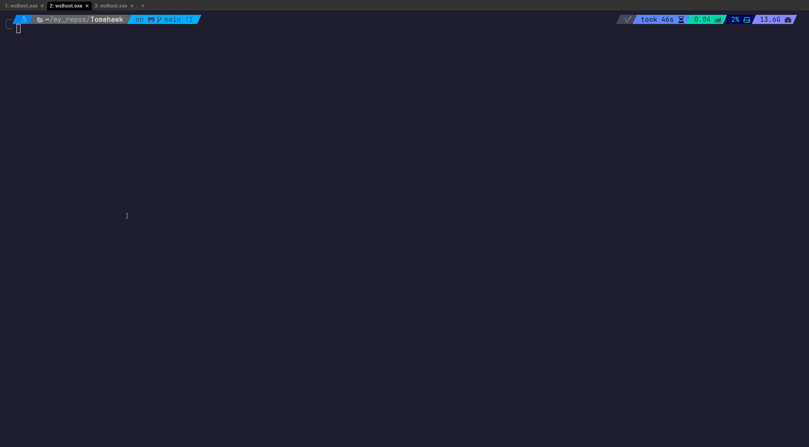

# Tomahawk
Manage the apache service on multiple remote systems via SSH with a simple TUI.

<br />



<br />

# Installing and running

Install dependencies and create virtual environment wuth uv.
```bash
uv sync
```

<br />

Activate virtual environment and run program
```bash
uv run main.py
```

<br />

Or do it all with one command
```bash
uv sync && uv run main.py
```

<br />

## How it works  

<br />

### Adding/removing hosts  
Add hosts using the select dropdown. The list of possible hosts to add is populated by the hosts in your ~/.ssh/config file.
Once you exit the app, and re-open any previously saved hosts will be added in the UI already.
All hosts are saved (hostnames only) in a small sqlite database under the name `tomahawk.db`.

<br />

### How it connects to remote machines  
All remote actions are made using an SSH connection and sending a simple command over to the remote machine.
No need to enter/save any credentials. As long as you're credentials in your SSH config file are valid you shoud be able to manage your hosts just fine.

<br />

### Logs  
Fetching logs retrives the latest 25 logs from the remote machine.

<br />

### Compatibility  
Works with debian based-systems using the systemd init system.

<br />

#### File locations  
- SSH config: `~/.ssh/config`
- Apache access log (remote machine): /var/log/apache2/access.log`
- Apache err log (remote machine): /var/log/apache2/error.log`
- Service log (remote machine): Using systemd journal `journalctl -u apache2`

<br />
   
Will work on making compatible other non-debian systems and sysvinit init systems at some point.

<br />

## Actions
`ctrl+q` - Quit Application
